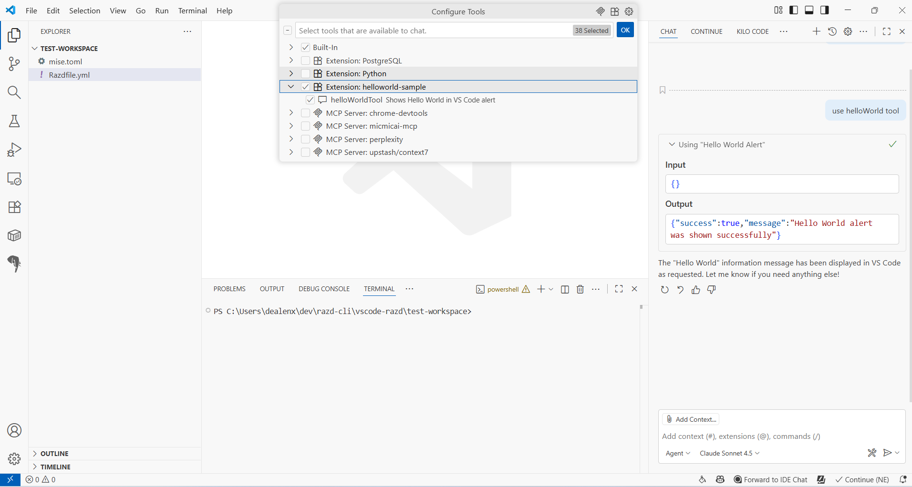

# VS Code Extension with MCP Tools for Copilot Chat

This example demonstrates how a VS Code extension can add MCP (Model Context Protocol) tools that integrate with GitHub Copilot Chat. The extension exposes custom tools that can be invoked directly from Copilot Chat, allowing AI-powered interactions with your extension's functionality.

Guide for this sample: https://code.visualstudio.com/api/get-started/your-first-extension.

## Demo

## VS Code API

### `vscode` module

- [`commands.registerCommand`](https://code.visualstudio.com/api/references/vscode-api#commands.registerCommand)
- [`window.showInformationMessage`](https://code.visualstudio.com/api/references/vscode-api#window.showInformationMessage)

### Contribution Points

- [`contributes.commands`](https://code.visualstudio.com/api/references/contribution-points#contributes.commands)

## Running the Sample

- Run `npm install` in terminal to install dependencies
- Run the `Run Extension` target in the Debug View. This will:
	- Start a task `npm: watch` to compile the code
	- Run the extension in a new VS Code window
